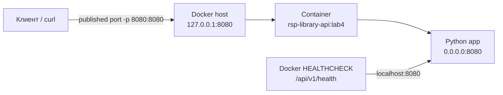

# Архитектура и обоснование контейнера

## 1. Что контейнеризируется

Контейнер запускает приложение из ЛР3: `app.main` поднимает HTTP-сервер, а слои `controller`, `service`, `repository`, `domain` и `config` остаются неизменными. ЛР4 меняет способ доставки и запуска приложения, сохраняя контракт `GET /api/v1/health`.

## 2. Решения в Dockerfile

- `python:3.12-slim` уменьшает размер образа по сравнению с полным Python-образом;
- приложение использует только стандартную библиотеку, поэтому отдельный builder-этап и установка зависимостей не нужны;
- `PYTHONDONTWRITEBYTECODE=1` не создаёт `.pyc`, `PYTHONUNBUFFERED=1` сразу выводит логи контейнера;
- `HTTP_HOST=0.0.0.0` обязателен внутри контейнера: привязка к `127.0.0.1` сделала бы сервис недоступным через опубликованный порт;
- процесс запускается от `appuser` с UID 10001, а не от root;
- `HEALTHCHECK` проверяет тот же API-маршрут, который демонстрируется преподавателю.

## 3. Ответы на контрольные вопросы

1. **Виртуальная машина и Docker-контейнер.** Виртуальная машина эмулирует полноценную гостевую ОС со своим ядром, поэтому обеспечивает сильную изоляцию, но требует больше памяти и времени запуска. Контейнер изолирует процессы и файловую систему на уровне ядра хоста, запускается быстрее и занимает меньше места, но использует ядро хостовой ОС.
2. **Зачем `.dockerignore`?** Он не отправляет лишние файлы в build context: `.git`, `.env`, кэши, тесты, логи и скриншоты. Без него сборка медленнее, образ может получить секреты или ненужные артефакты, а кэш Docker будет чаще инвалидироваться.
3. **Multi-stage build.** Многоэтапная сборка разделяет builder и runtime: компиляторы и SDK используются только для сборки, а в финальный образ копируются готовые артефакты. Это уменьшает размер и поверхность атаки. Для текущего приложения без компиляции достаточно одного slim runtime-этапа.
4. **Почему отдельно копируют зависимости и исходный код?** Слой зависимостей меняется реже исходников. Если зависимости скопированы и установлены отдельным слоем, Docker повторно использует кэш и не скачивает их после каждого изменения кода. В текущем проекте внешних зависимостей нет, поэтому копируется только исполняемый пакет.
5. **`EXPOSE` и `-p`.** `EXPOSE 8080` документирует порт, который приложение слушает внутри образа, и сам по себе его наружу не публикует. `docker run -p 8080:8080` создаёт фактическое перенаправление с порта хоста на порт контейнера; для доступа извне нужен именно `-p`.
